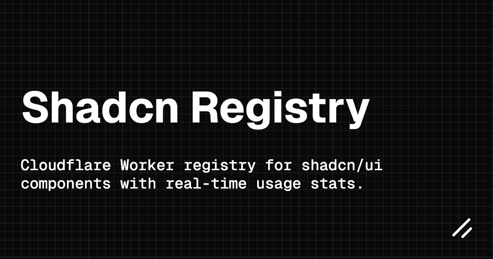

A Cloudflare Worker service that acts as a registry for shadcn/ui components, tracking component usage statistics in real time.

## Features

- **Serves Static Component JSON Files:** Component files are stored in the `public/static` folder and served via the `/r/:objectName` endpoint.
- **Real-time Usage Tracking:** Download counts are incremented and stored using Cloudflare KV (binding name: `KV`).
- **Simple API Endpoints:** Retrieve components and their usage statistics easily.
- **Built on Hono:** Uses the lightweight [`Hono`](https://github.com/honojs/hono) framework for routing.
- **CORS Enabled:** All routes have CORS enabled for broad accessibility.

## Bindings

- **KV**: Cloudflare KV Namespace for tracking download counts. Must be bound as `KV`.
- **REGISTRY**: Fetcher binding for serving static files from the `public/static` directory.

## API Endpoints

### GET `/r/:objectName`

- **Description:** Retrieves a component JSON file from the static registry and increments its download count asynchronously.
- **Usage:** Make a GET request replacing `:objectName` with the JSON filename (e.g., `button.json`).
- **Error Handling:**
  - Returns `400` if `objectName` is missing or does not end with `.json`.
  - Returns `404` if the file is not found.

### GET `/s/:objectName`

- **Description:** Returns the statistics for a specific component including:
  - `objectKey`: The key used in KV (filename without `.json`)
  - `fileName`: The JSON filename
  - `downloads`: Total download count
- **Caching:** This endpoint is cached for 10 minutes (`max-age=600`). Statistics updates may be delayed by this cache duration.
- **Error Handling:**
  - Returns `400` if `objectName` is missing.
  - Returns `404` if the object is not found in KV.

## Development

1. **Clone the Repository**
   ```sh
   git clone https://github.com/R4ULtv/shadcn-registry.git
   ```
2. **Install Dependencies:**
   ```sh
   pnpm install
   ```
3. **Configure KV Namespace ID:**
   Update your KV namespace ID in `wrangler.jsonc`.
   ```jsonc
   "kv_namespaces": [
    {
      "binding": "KV",
      "id": "your-kv-namespace-id"
    }
   ]
   ```
4. **Add Component JSON Files:**
   Place your component JSON files in the `public/static` folder. These files will be served by the registry and tracked for usage statistics.
5. **Run Locally:**
   ```sh
   pnpm run dev
   ```
6. **Deploy:**
   ```sh
   pnpm run deploy
   ```

## Build Script

For the best implementation, you can add the following script to your main project's `package.json` to output the build in the `public/static` folder. This is just a suggestion - feel free to implement it however you prefer.

```json
"scripts": {
  "registry:build": "shadcn build --output public/static"
}
```

## Authentication (Optional)

Authentication is **not implemented by default**. To add a layer of security, you can implement simple token-based authentication as described below. This involves requiring a `token` query parameter on your registry endpoints (e.g., `/r/:objectName?token=YOUR_SECURE_TOKEN`).

**Example Usage:**
```
GET /r/button.json?token=YOUR_SECURE_TOKEN
```

On the server, check the `token` parameter. If it's missing or invalid, return a `401 Unauthorized` response.

**Sample Hono Middleware:**

```ts
const AUTH_TOKEN = 'YOUR_SECURE_TOKEN'; // Use env vars in production
const requireToken = (c, next) => {
  if (c.req.query('token') !== AUTH_TOKEN) {
    return c.text('Unauthorized', 401);
  }
  return next();
};

app.get('/r/:objectName', requireToken, ...);
// You may also want to protect the stats endpoint:
app.get('/s/:objectName', requireToken, ...);
```

Replace `YOUR_SECURE_TOKEN` with your actual token. For more, see the [shadcn registry docs](https://ui.shadcn.com/docs/registry/getting-started#adding-auth).

## License

This project is licensed under the MIT License - see the [LICENSE](LICENSE) file for details.
